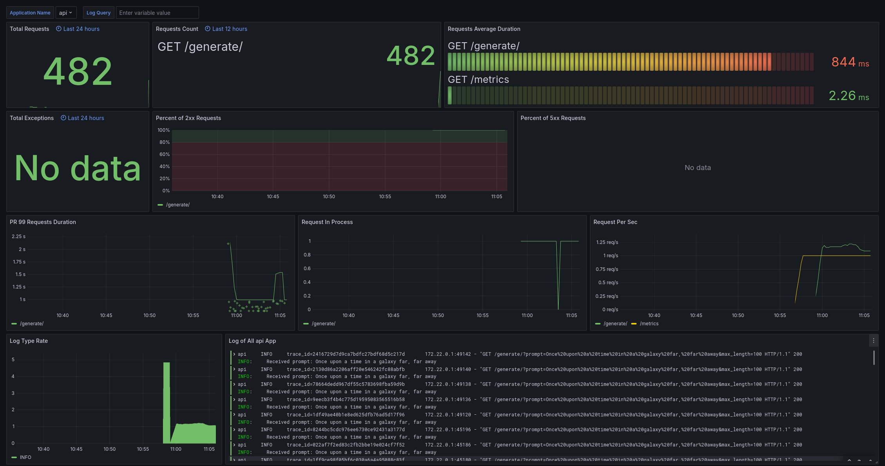
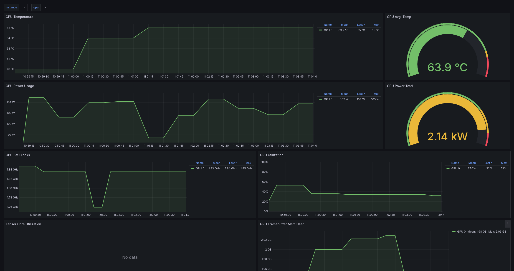

# What is this?





Batteries Included AI Deployment is just what it says, an all in one template to deploy AI models with the highest quality dev experience out of the box. This repo contains:

1. A way to download and cache models straight from huggingface
1. A way to expose those cached models via a FastAPI server endpoint
1. A docker configuration that exposes a `debugpy` port so that you can debug your running application while its running inside of a docker container
1. A way to run tests
1. A way to debug tests (using `debugpy` as mentioned above)
1. A way to run pre-commits on your code from within docker
1. A way to manually run pre-commits on all code in your repository. Code quality matters!
1. CI steps via GitHub Actions
1. Full Observability with a Grafana Dashboard
1. Metrics via Prometheus
1. Tracing via Tempo
1. Logs via Loki
1. GPU monitoring via DCGM
1. CD via GitHub actions and a `post-receive` hook on the server
1. Alerts that email you when something goes wrong in production

All from within Docker.

# Why?

Because I am sick and tired of all of these things missing from my deployments. When I am starting a new project, I want it to be up and running ASAP with as high quality of an experience as I can muster. Not only that, but 5 years down the road when I have a feature I want to add to this, I don't want to be screwing around with python versions and environments. There are too many verticals going on here to be worrying about boilerplate like that.

This is not only desgined to improve the speed of development and DX, but also to preserve the state of the repository over time. It is designed to be in a runnable _and_ developable state at any given point on any machine that supports Docker.

# Developing -- a 10,000ft view

`make setup` runs a download script in a docker container that caches a local copy of GPT-2. This must be run before running the application or tests.

`make run` runs the application, `make run-debug` runs the application with an open debugger port. Likewise with `make test` and `make test-debug`. `make test-cicd` is the exact same as `make test` except it does not run with GPU support. This is simply due to the fact that default runners for GitHub Actions do not use GPUs and it takes some amount of effort and special permissions to get them.

`make clean` cleans up unused docker images.

`make precommit` runs pre-commit on staged files and `make precommit-all` runs pre-commit on all files in your repository.

`make request` makes a request to a locally hosted API instance.

# Setup and helpful information

Despite this being "Batteries Included", there is only so much I can template, therefore there are a few things that you will need to set up and provide to have a great AI deployment experience. Fortunately there aren't that many

## Install

Install `docker`: https://docs.docker.com/engine/install/

Install the `loki` docker plugin: `docker plugin install grafana/loki-docker-driver:latest --alias loki --grant-all-permissions`

Optionally install CUDA container toolkit to allow the container ot access the GPU and increase inference speed: https://docs.nvidia.com/datacenter/cloud-native/container-toolkit/latest/install-guide.html

You may also need to install `make`: `sudo apt-get install make`

## Pre-commit

Add the following to your `.git/hooks/pre-commit` file:

```
#!/bin/sh

# Run the precommit target using make
make precommit

if [ $? -ne 0 ]; then
  echo "Pre-commit hook failed. Aborting commit."
  exit 1
fi

# Allow the commit to proceed
exit 0
```

Then make it executable with `chmod +x .git/hooks/pre-commit`. This will run pre-commit on your staged files within a dockerfile.

## Alerts in Prod

To get alerts to work properly in production, you'll need to configure Grafana to send emails. If you're using Gmail, follow these steps to set up an App Password:

1. Go to your Google Account settings (https://myaccount.google.com/).
1. Navigate to the "Security" tab.
1. Under "How you sign in to Google", find "2-Step Verification" and turn it on if it's not already enabled.
1. After enabling 2-Step Verification, scroll down to find "App passwords" and click on it.
1. Select "Other (Custom name)" from the dropdown menu.
1. Enter a name for the app (e.g., "Grafana Alerts") and click "Create".
1. Google will generate a 16-character app password. Copy this password.
1. Use this App password in your Grafana SMTP configuration instead of your regular Gmail password.

After generating the App Password, update the `./etc/grafana/grafana.ini` file with your email and password.

```
[smtp]
enabled = true
host = smtp.gmail.com:587
user = you@gmail.com
password = """app password"""
skip_verify = true
from_address = you@gmail.com
from_name = Grafana Alerts
```

Alerts are going to be different for every person, but to test that they work you can go to `http://127.0.0.1:3000/alerting/notifications/receivers/new`, add your address to the `Adresses` section and click the `Test` button. Within a few minutes you should recieve a test email alert.

## Continuous Deployment

This step is the most involved, but it's not too difficult to set up and is not even necessary if you only care about getting this set up locally. Before proceeding, make sure you have:

1. A GPU server you have SSH access to. These instructions assume you are SSH'd into the server as the root user.
1. That server has `docker`, `loki`, `CUDA`, and `make` installed on it (see setup above for instructions)

On your local server, generate a new SSH keypair:

```
ssh-keygen -t rsa -b 4096 -C "your_email@example.com"
```

This is going to be the key that GitHub uses to push updates to your repository. After that, SSH into your server:

```
ssh root@yourserver.com
```

Then add the public key you just generated to `~/.ssh/authorized_keys` and run `chmod 600 ~/.ssh/authorized_keys`. While you're logged into your server, create the directories `/root/api/` and `/root/api/.git/`, then `cd` into `/root/api/.git/` and run:

```
git init --bare
git config receive.denyCurrentBranch updateInstead
```

This creates a bare repo and allows you to push updates to it. In the `.git/hooks/` folder, create a file called `post-receive` and add the following to it:

```
git --work-tree=/root/api --git-dir=/root/api/.git checkout -f
cd /root/api
docker compose down
docker compose up --build api tempo grafana --remove-orphans -d
```

Make sure to run `chmod +x hooks/post-receive` to make it executable. This will run after every time code is pushed to this repository.

Now that the server is set up to recieve pushed code, we need to set up GitHub Actions to actually push the code. There is a commented out sample in `.github/workflows/tests.yaml`:

```
  deploy:
    needs: test
    runs-on: ubuntu-latest

    steps:
      - name: Checkout repository
        uses: actions/checkout@v2
        with:
          fetch-depth: 0

      - name: Deploy to server
        env:
          SSH_PRIVATE_KEY: ${{ secrets.SERVER_SSH_PRIVATE_KEY }}
        run: |
          mkdir -p ~/.ssh
          echo "$SSH_PRIVATE_KEY" > ~/.ssh/id_rsa
          chmod 600 ~/.ssh/id_rsa
          ssh-keyscan -H yourserver.com >> ~/.ssh/known_hosts
          git remote add deploy ssh://root@yourserver.com/root/api
          git push deploy master
```

To get GitHub to push updates to your server, you need to first add your private key as a secret here: https://github.com/your-username/your-repository/settings/secrets/actions. If you would like, you could also add the `deploy` remote to your local development repository:

```
git remote add deploy ssh://root@yourserver.com/root/api
```

Though this is not recommended as this would bypass the automated testing phase in CI.

At this point you have continuous deployment set up!

# Debug Configurations

I use neovim with `nvim-dap`, so these instructions are meant for that but there is no reason why you can't have your own setup for VS Code or some other editor. If you need help starting it up using something other than Neovim, ask your friendly local AI for help (maybe even using this repo!) and make a PR when you get it working.

First I set up an adapter to connect to the open debugpy port on localhost:

```
      dap.adapters.python = {
        type = 'server',
        host = 'localhost',
        port = 5678, -- This should match the port that debugpy is listening on in Docker
      }
```

Then I set up a python configuration:

```
      dap.configurations.python = {
        {
          -- Connect to the Python process in Docker
          type = 'python',
          request = 'attach',
          name = 'Dockerfile - /workspace',
          pathMappings = {
            {
              localRoot = vim.fn.getcwd(), -- The directory of your project on your local filesystem
              remoteRoot = '/workspace', -- The directory in Docker where your project is mounted
            },
          },
        },
```

# Future work

There are some things that I'd like to add at some point in the future but weren't critical to getting this first version up and running:

1. `nvitop` dashboard instead of (in addition to?) DCGM.
1. Grafana dashboard persistence between deployments. Right now it deletes alerts and changes made.
1. Threaded logging since it's synchronous and blocking by default.

# Credits

Thanks to @blueswen's [fastapi-observability](https://github.com/blueswen/fastapi-observability) repo which formed a strong base for the observability parts of this repo.

Thanks to @NVIDIA's [dcgm-exporter](https://github.com/NVIDIA/dcgm-exporter) which is what I'm using for the GPU dashboard.
